# Pickleball App Database Design
## Tài Liệu Thiết Kế Cơ Sở Dữ Liệu

---

## 📋 Tổng quan

**Pickleball App** là ứng dụng quản lý giải đấu pickleball, bao gồm:
- ✅ **Authentication**: Đăng nhập (Email/Password, Google, Apple), Refresh Token.
- ✅ **Tournament**: Tạo giải, quản lý bảng đấu Round Robin, tính điểm tự động.
- ✅ **Match & Scoring**: Nhập điểm real-time, xếp hạng bảng, audit trail khi sửa điểm.
- ✅ **Community**: Game giao hữu cộng đồng, tìm kiếm theo vị trí.
- ✅ **Social**: Follow/Unfollow, hồ sơ người chơi.
- ✅ **Chat**: Chat 1-1 và nhóm qua SignalR.
- ✅ **Notifications**: Push (FCM) + In-app notifications.

**Schema**: `public`
**Database**: `pickleball_db` (PostgreSQL 16)
**ORM**: Entity Framework Core 8
**Primary Key**: INTEGER GENERATED ALWAYS AS IDENTITY
**File Storage**: Cloudinary (Miễn phí)

---

## 📊 Database Diagram

```mermaid
erDiagram
    %% ========================================
    %% CORE ENTITIES
    %% ========================================

    %% ===== GROUP 1: AUTH & PROFILE =====
    users ||--o{ refresh_tokens : "has tokens"
    users ||--o{ follows : "follows others"
    users ||--o{ follows : "followed by"

    %% ===== GROUP 2: TOURNAMENT =====
    users ||--o{ tournaments : "creates"
    users ||--o{ participants : "joins"
    tournaments ||--o{ participants : "has participants"
    tournaments ||--o{ teams : "has teams"
    tournaments ||--o{ groups : "has groups"
    tournaments ||--o{ matches : "has matches"

    %% ===== GROUP 3: GROUPS & MEMBERS =====
    groups ||--o{ group_members : "has members"
    groups ||--o{ matches : "has matches"

    %% ===== GROUP 4: MATCH & SCORING =====
    matches ||--o{ match_score_histories : "has score edits"
    users ||--o{ match_score_histories : "edits scores"

    %% ===== GROUP 5: COMMUNITY =====
    users ||--o{ community_games : "creates"
    community_games ||--o{ game_participants : "has participants"
    users ||--o{ game_participants : "joins"

    %% ===== GROUP 6: CHAT =====
    chat_rooms ||--o{ chat_members : "has members"
    chat_rooms ||--o{ messages : "has messages"
    users ||--o{ chat_members : "joins rooms"
    users ||--o{ messages : "sends"

    %% ===== GROUP 7: NOTIFICATIONS =====
    users ||--o{ notifications : "receives"
    users ||--o{ device_tokens : "has devices"

    %% ========================================
    %% ENTITY DEFINITIONS
    %% ========================================

    %% ----- Auth & Profile -----
    users {
        int id PK "INTEGER GENERATED ALWAYS AS IDENTITY"
        string email UK "VARCHAR(255) NOT NULL"
        string password_hash "VARCHAR(255) NOT NULL"
        string name "VARCHAR(100) NOT NULL"
        string avatar_url "VARCHAR(500) Cloudinary URL"
        string bio "TEXT"
        decimal skill_level "DECIMAL(2,1) DEFAULT 3.0"
        string dominant_hand "VARCHAR(10)"
        string paddle_type "VARCHAR(100)"
        string provider "VARCHAR(20) OAuth provider"
        string provider_id "VARCHAR(255) OAuth ID"
        timestamp created_at "DEFAULT NOW()"
        timestamp updated_at "DEFAULT NOW()"
    }

    refresh_tokens {
        int id PK "INTEGER GENERATED ALWAYS AS IDENTITY"
        int user_id FK "users(id) NOT NULL"
        string token_hash "VARCHAR(500) NOT NULL"
        timestamp expires_at "NOT NULL"
        timestamp created_at "DEFAULT NOW()"
        timestamp revoked_at "TIMESTAMP"
        int replaced_by_token_id FK "refresh_tokens(id)"
    }

    follows {
        int id PK "INTEGER GENERATED ALWAYS AS IDENTITY"
        int follower_id FK "users(id) NOT NULL"
        int following_id FK "users(id) NOT NULL"
        timestamp created_at "DEFAULT NOW()"
    }

    %% ----- Tournament -----
    tournaments {
        int id PK "INTEGER GENERATED ALWAYS AS IDENTITY"
        int creator_id FK "users(id) NOT NULL"
        string name "VARCHAR(200) NOT NULL"
        string description "TEXT"
        string type "VARCHAR(10) singles or doubles"
        int num_groups "INTEGER NOT NULL"
        string scoring_format "VARCHAR(15) DEFAULT best_of_3"
        string status "VARCHAR(15) DEFAULT draft"
        date date "DATE"
        string location "VARCHAR(500)"
        string banner_url "VARCHAR(500) Cloudinary URL"
        timestamp created_at "DEFAULT NOW()"
        timestamp updated_at "DEFAULT NOW()"
    }

    participants {
        int id PK "INTEGER GENERATED ALWAYS AS IDENTITY"
        int tournament_id FK "tournaments(id) NOT NULL"
        int user_id FK "users(id) NOT NULL"
        string status "VARCHAR(20) DEFAULT request_pending"
        int invited_by FK "users(id)"
        string reject_reason "VARCHAR(500)"
        timestamp joined_at "TIMESTAMP"
        timestamp created_at "DEFAULT NOW()"
    }

    teams {
        int id PK "INTEGER GENERATED ALWAYS AS IDENTITY"
        int tournament_id FK "tournaments(id) NOT NULL"
        string name "VARCHAR(100)"
        int player1_id FK "users(id) NOT NULL"
        int player2_id FK "users(id) NOT NULL"
        timestamp created_at "DEFAULT NOW()"
    }

    groups {
        int id PK "INTEGER GENERATED ALWAYS AS IDENTITY"
        int tournament_id FK "tournaments(id) NOT NULL"
        string name "VARCHAR(10) NOT NULL"
        int display_order "INTEGER NOT NULL"
    }

    group_members {
        int id PK "INTEGER GENERATED ALWAYS AS IDENTITY"
        int group_id FK "groups(id) NOT NULL"
        int player_id FK "users(id) Singles"
        int team_id FK "teams(id) Doubles"
        int seed_order "INTEGER 1-4"
    }

    %% ----- Match & Scoring -----
    matches {
        int id PK "INTEGER GENERATED ALWAYS AS IDENTITY"
        int tournament_id FK "tournaments(id) NOT NULL"
        int group_id FK "groups(id) NOT NULL"
        int round "INTEGER 1-3"
        int match_order "INTEGER 1-2"
        int player1_id "INTEGER NOT NULL"
        int player2_id "INTEGER NOT NULL"
        jsonb player1_scores "JSONB"
        jsonb player2_scores "JSONB"
        int winner_id "INTEGER"
        string status "VARCHAR(15) DEFAULT scheduled"
        timestamp created_at "DEFAULT NOW()"
        timestamp updated_at "DEFAULT NOW()"
    }

    match_score_histories {
        int id PK "INTEGER GENERATED ALWAYS AS IDENTITY"
        int match_id FK "matches(id) NOT NULL"
        int modified_by FK "users(id) NOT NULL"
        jsonb old_player1_scores "JSONB"
        jsonb old_player2_scores "JSONB"
        jsonb new_player1_scores "JSONB NOT NULL"
        jsonb new_player2_scores "JSONB NOT NULL"
        string reason "VARCHAR(500)"
        timestamp created_at "DEFAULT NOW()"
    }

    %% ----- Community -----
    community_games {
        int id PK "INTEGER GENERATED ALWAYS AS IDENTITY"
        int creator_id FK "users(id) NOT NULL"
        string title "VARCHAR(200) NOT NULL"
        string description "TEXT"
        timestamp date "TIMESTAMPTZ NOT NULL"
        string location "VARCHAR(500) NOT NULL"
        decimal latitude "DECIMAL(10,8)"
        decimal longitude "DECIMAL(11,8)"
        int max_players "INTEGER NOT NULL"
        string skill_level "VARCHAR(20) DEFAULT all"
        string status "VARCHAR(15) DEFAULT open"
        timestamp created_at "DEFAULT NOW()"
        timestamp updated_at "DEFAULT NOW()"
    }

    game_participants {
        int id PK "INTEGER GENERATED ALWAYS AS IDENTITY"
        int game_id FK "community_games(id) NOT NULL"
        int user_id FK "users(id) NOT NULL"
        string status "VARCHAR(15) DEFAULT confirmed"
        int waitlist_position "INTEGER"
        timestamp joined_at "DEFAULT NOW()"
    }

    %% ----- Chat -----
    chat_rooms {
        int id PK "INTEGER GENERATED ALWAYS AS IDENTITY"
        string type "VARCHAR(10) direct or group"
        string name "VARCHAR(100)"
        timestamp created_at "DEFAULT NOW()"
    }

    chat_members {
        int id PK "INTEGER GENERATED ALWAYS AS IDENTITY"
        int room_id FK "chat_rooms(id) NOT NULL"
        int user_id FK "users(id) NOT NULL"
        timestamp joined_at "DEFAULT NOW()"
        timestamp muted_until "TIMESTAMP"
        int last_read_message_id "INTEGER"
    }

    messages {
        int id PK "INTEGER GENERATED ALWAYS AS IDENTITY"
        int room_id FK "chat_rooms(id) NOT NULL"
        int sender_id FK "users(id) NOT NULL"
        string content "TEXT NOT NULL"
        string type "VARCHAR(10) DEFAULT text"
        timestamp created_at "DEFAULT NOW()"
    }

    %% ----- Notifications -----
    notifications {
        int id PK "INTEGER GENERATED ALWAYS AS IDENTITY"
        int user_id FK "users(id) NOT NULL"
        string type "VARCHAR(30) NOT NULL"
        string title "VARCHAR(200) NOT NULL"
        string body "TEXT"
        jsonb data "JSONB Deep link data"
        boolean is_read "DEFAULT FALSE"
        timestamp created_at "DEFAULT NOW()"
    }

    device_tokens {
        int id PK "INTEGER GENERATED ALWAYS AS IDENTITY"
        int user_id FK "users(id) NOT NULL"
        string token "VARCHAR(500) UK NOT NULL"
        string platform "VARCHAR(10) ios android web"
        timestamp created_at "DEFAULT NOW()"
        timestamp updated_at "DEFAULT NOW()"
    }
```



---

## 🗄️ Database Tables

### 1. Table: users (Tài khoản & Hồ sơ)
Lưu thông tin tài khoản và hồ sơ người chơi. Hỗ trợ đăng nhập local (email/password) và OAuth (Google, Apple).

| Column | Type | Constraints | Description |
|--------|------|-------------|-------------|
| id | `INTEGER` | PK, GENERATED ALWAYS AS IDENTITY | ID người dùng |
| email | `VARCHAR(255)` | UNIQUE, NOT NULL | Email đăng nhập |
| password_hash | `VARCHAR(255)` | NOT NULL | bcrypt hash |
| name | `VARCHAR(100)` | NOT NULL | Tên hiển thị |
| avatar_url | `VARCHAR(500)` | | Link ảnh đại diện (Cloudinary) |
| bio | `TEXT` | | Tiểu sử ngắn |
| skill_level | `DECIMAL(2,1)` | NOT NULL, DEFAULT 3.0 | Trình độ 1.0 - 5.0 |
| dominant_hand | `VARCHAR(10)` | | `'left'` / `'right'` |
| paddle_type | `VARCHAR(100)` | | Loại vợt |
| provider | `VARCHAR(20)` | | `'local'` / `'google'` / `'apple'` |
| provider_id | `VARCHAR(255)` | | ID từ OAuth provider |
| created_at | `TIMESTAMPTZ` | NOT NULL, DEFAULT NOW() | Ngày tạo |
| updated_at | `TIMESTAMPTZ` | NOT NULL, DEFAULT NOW() | Ngày cập nhật |

**Constraints:**
- `UQ_Users_Email` UNIQUE (email)
- `CK_Users_SkillLevel` CHECK (skill_level >= 1.0 AND skill_level <= 5.0)
- `CK_Users_DominantHand` CHECK (dominant_hand IN ('left', 'right') OR dominant_hand IS NULL)

**Indexes:**
- PRIMARY KEY (id)
- UNIQUE (email)
- INDEX (provider, provider_id) — Lookup OAuth login

---

### 2. Table: refresh_tokens (Token làm mới)
Lưu refresh token để cấp lại access token. Mỗi user có thể có nhiều refresh token (multi-device).

| Column | Type | Constraints | Description |
|--------|------|-------------|-------------|
| id | `INTEGER` | PK, GENERATED ALWAYS AS IDENTITY | ID |
| user_id | `INTEGER` | FK → users(id), NOT NULL | ID user |
| token_hash | `VARCHAR(500)` | NOT NULL | Hash của refresh token |
| expires_at | `TIMESTAMPTZ` | NOT NULL | Thời điểm hết hạn |
| created_at | `TIMESTAMPTZ` | NOT NULL, DEFAULT NOW() | Ngày tạo |
| revoked_at | `TIMESTAMPTZ` | | Ngày bị thu hồi |
| replaced_by_token_id | `INTEGER` | FK → refresh_tokens(id) | Token thay thế (rotation) |

**Indexes:**
- PRIMARY KEY (id)
- INDEX (user_id) — Tìm tokens của user
- INDEX (token_hash) — Verify refresh token

---

### 3. Table: follows (Quan hệ theo dõi)
Quan hệ theo dõi giữa users (many-to-many).

| Column | Type | Constraints | Description |
|--------|------|-------------|-------------|
| id | `INTEGER` | PK, GENERATED ALWAYS AS IDENTITY | ID |
| follower_id | `INTEGER` | FK → users(id), NOT NULL | Người theo dõi |
| following_id | `INTEGER` | FK → users(id), NOT NULL | Người được theo dõi |
| created_at | `TIMESTAMPTZ` | NOT NULL, DEFAULT NOW() | Ngày theo dõi |

**Constraints:**
- `UQ_Follows_Pair` UNIQUE (follower_id, following_id)
- `CK_Follows_NoSelfFollow` CHECK (follower_id != following_id)

**Indexes:**
- PRIMARY KEY (id)
- INDEX (follower_id) — Danh sách đang follow
- INDEX (following_id) — Danh sách followers

---

### 4. Table: tournaments (Giải đấu)
Bảng chính lưu thông tin giải đấu. Hỗ trợ Singles (đấu đơn) và Doubles (đấu đôi).

| Column | Type | Constraints | Description |
|--------|------|-------------|-------------|
| id | `INTEGER` | PK, GENERATED ALWAYS AS IDENTITY | ID giải đấu |
| creator_id | `INTEGER` | FK → users(id), NOT NULL | Người tạo giải |
| name | `VARCHAR(200)` | NOT NULL | Tên giải đấu |
| description | `TEXT` | | Mô tả chi tiết |
| type | `VARCHAR(10)` | NOT NULL | `'singles'` / `'doubles'` |
| num_groups | `INTEGER` | NOT NULL | Số bảng đấu |
| scoring_format | `VARCHAR(15)` | NOT NULL, DEFAULT 'best_of_3' | `'best_of_1'` / `'best_of_3'` |
| status | `VARCHAR(15)` | NOT NULL, DEFAULT 'draft' | Trạng thái giải |
| date | `DATE` | | Ngày thi đấu |
| location | `VARCHAR(500)` | | Địa điểm |
| banner_url | `VARCHAR(500)` | | Ảnh bìa (Cloudinary) |
| created_at | `TIMESTAMPTZ` | NOT NULL, DEFAULT NOW() | |
| updated_at | `TIMESTAMPTZ` | NOT NULL, DEFAULT NOW() | |

**Constraints:**
- `CK_Tournaments_Type` CHECK (type IN ('singles', 'doubles'))
- `CK_Tournaments_ScoringFormat` CHECK (scoring_format IN ('best_of_1', 'best_of_3'))
- `CK_Tournaments_Status` CHECK (status IN ('draft', 'open', 'ready', 'in_progress', 'completed', 'cancelled'))
- `CK_Tournaments_NumGroups` CHECK: Singles ∈ {1,2,3,4}, Doubles ∈ {1,2}

**Indexes:**
- PRIMARY KEY (id)
- INDEX (creator_id) — Giải của tôi
- INDEX (status) — Lọc theo trạng thái
- INDEX (date) — Sắp xếp theo ngày
- INDEX (status, date DESC) — Listing giải đang mở

**Notes:**
- Singles: NumGroups × 4 = max participants (4/8/12/16)
- Doubles: NumGroups × 4 = max teams, × 2 = max người (8/16)
- Status flow: `draft → open → ready → in_progress → completed`

---

### 5. Table: participants (Người tham gia giải)
Quan hệ nhiều-nhiều giữa Users và Tournaments, kèm trạng thái tham gia.

| Column | Type | Constraints | Description |
|--------|------|-------------|-------------|
| id | `INTEGER` | PK, GENERATED ALWAYS AS IDENTITY | ID |
| tournament_id | `INTEGER` | FK → tournaments(id), NOT NULL | ID giải |
| user_id | `INTEGER` | FK → users(id), NOT NULL | ID người chơi |
| status | `VARCHAR(20)` | NOT NULL, DEFAULT 'request_pending' | Trạng thái |
| invited_by | `INTEGER` | FK → users(id) | Người mời (NULL nếu tự xin) |
| reject_reason | `VARCHAR(500)` | | Lý do từ chối |
| joined_at | `TIMESTAMPTZ` | | Thời điểm xác nhận tham gia |
| created_at | `TIMESTAMPTZ` | NOT NULL, DEFAULT NOW() | |

**Constraints:**
- `UQ_Participants_Tournament_User` UNIQUE (tournament_id, user_id)
- `CK_Participants_Status` CHECK (status IN ('confirmed', 'invited_pending', 'request_pending', 'rejected'))

**Indexes:**
- PRIMARY KEY (id)
- UNIQUE (tournament_id, user_id)
- INDEX (tournament_id) — DS người tham gia
- INDEX (user_id) — Giải đã tham gia
- INDEX (tournament_id, status) — Đếm confirmed

**Notes:**
- Status flow:
  ```
  invited_pending → confirmed (chấp nhận lời mời)
  invited_pending → rejected  (từ chối lời mời)
  request_pending → confirmed (creator duyệt)
  request_pending → rejected  (creator từ chối)
  ```

---

### 6. Table: teams (Đội — chỉ Doubles)
Đội trong giải đấu đôi. Mỗi đội gồm 2 người chơi.

| Column | Type | Constraints | Description |
|--------|------|-------------|-------------|
| id | `INTEGER` | PK, GENERATED ALWAYS AS IDENTITY | ID đội |
| tournament_id | `INTEGER` | FK → tournaments(id), NOT NULL | ID giải |
| name | `VARCHAR(100)` | | Tên đội (tự chọn hoặc auto) |
| player1_id | `INTEGER` | FK → users(id), NOT NULL | Thành viên 1 |
| player2_id | `INTEGER` | FK → users(id), NOT NULL | Thành viên 2 |
| created_at | `TIMESTAMPTZ` | NOT NULL, DEFAULT NOW() | |

**Constraints:**
- `CK_Teams_DifferentPlayers` CHECK (player1_id != player2_id)

**Indexes:**
- PRIMARY KEY (id)
- INDEX (tournament_id) — Đội trong giải

---

### 7. Table: groups (Bảng đấu)
Mỗi giải có N bảng, mỗi bảng 4 đơn vị thi đấu.

| Column | Type | Constraints | Description |
|--------|------|-------------|-------------|
| id | `INTEGER` | PK, GENERATED ALWAYS AS IDENTITY | ID bảng |
| tournament_id | `INTEGER` | FK → tournaments(id), NOT NULL | ID giải |
| name | `VARCHAR(10)` | NOT NULL | `'A'`, `'B'`, `'C'`, `'D'` |
| display_order | `INTEGER` | NOT NULL | Thứ tự hiển thị |

**Constraints:**
- `UQ_Groups_Tournament_Name` UNIQUE (tournament_id, name)
- `UQ_Groups_Tournament_Order` UNIQUE (tournament_id, display_order)

**Indexes:**
- PRIMARY KEY (id)
- INDEX (tournament_id) — Bảng trong giải

---

### 8. Table: group_members (Thành viên bảng đấu)
Lưu player (Singles) hoặc team (Doubles) thuộc bảng nào.

| Column | Type | Constraints | Description |
|--------|------|-------------|-------------|
| id | `INTEGER` | PK, GENERATED ALWAYS AS IDENTITY | ID |
| group_id | `INTEGER` | FK → groups(id), NOT NULL | ID bảng |
| player_id | `INTEGER` | FK → users(id) | FK → Users (Singles), NULL nếu Doubles |
| team_id | `INTEGER` | FK → teams(id) | FK → Teams (Doubles), NULL nếu Singles |
| seed_order | `INTEGER` | NOT NULL | Thứ tự seed (1-4) |

**Constraints:**
- `CK_GroupMembers_OneType` CHECK: (player_id IS NOT NULL AND team_id IS NULL) OR ngược lại
- `CK_GroupMembers_SeedOrder` CHECK (seed_order BETWEEN 1 AND 4)

**Indexes:**
- PRIMARY KEY (id)
- INDEX (group_id) — Thành viên trong bảng

**Notes:**
- Với Singles: `player_id` = User ID, `team_id` = NULL
- Với Doubles: `player_id` = NULL, `team_id` = Team ID
- Mỗi bảng luôn có đúng **4 thành viên** (4 cá nhân hoặc 4 đội)

---

### 9. Table: matches (Trận đấu)
Trận đấu trong giải. Mỗi bảng 4 đơn vị → 6 trận, 3 vòng (Round Robin).

| Column | Type | Constraints | Description |
|--------|------|-------------|-------------|
| id | `INTEGER` | PK, GENERATED ALWAYS AS IDENTITY | ID trận |
| tournament_id | `INTEGER` | FK → tournaments(id), NOT NULL | ID giải |
| group_id | `INTEGER` | FK → groups(id), NOT NULL | ID bảng |
| round | `INTEGER` | NOT NULL | Vòng thi đấu (1-3) |
| match_order | `INTEGER` | NOT NULL | Thứ tự trận trong vòng (1-2) |
| player1_id | `INTEGER` | NOT NULL | User ID (Singles) hoặc Team ID (Doubles) |
| player2_id | `INTEGER` | NOT NULL | User ID (Singles) hoặc Team ID (Doubles) |
| player1_scores | `JSONB` | | Điểm từng set, vd: `[11, 9, 11]` |
| player2_scores | `JSONB` | | Điểm từng set, vd: `[7, 11, 8]` |
| winner_id | `INTEGER` | | ID người/đội thắng |
| status | `VARCHAR(15)` | NOT NULL, DEFAULT 'scheduled' | Trạng thái trận đấu |
| created_at | `TIMESTAMPTZ` | NOT NULL, DEFAULT NOW() | |
| updated_at | `TIMESTAMPTZ` | NOT NULL, DEFAULT NOW() | |

**Constraints:**
- `CK_Matches_Round` CHECK (round BETWEEN 1 AND 3)
- `CK_Matches_MatchOrder` CHECK (match_order BETWEEN 1 AND 2)
- `CK_Matches_Status` CHECK (status IN ('scheduled', 'in_progress', 'completed', 'walkover'))
- `CK_Matches_DifferentPlayers` CHECK (player1_id != player2_id)
- `UQ_Matches_Unique` UNIQUE (group_id, round, match_order)

**Indexes:**
- PRIMARY KEY (id)
- INDEX (tournament_id) — Lịch thi đấu
- INDEX (group_id) — Trận trong bảng
- INDEX (group_id, status) — Trận chưa đấu

**Notes:**
- **Lịch Round Robin cố định** (mỗi bảng A, B, C, D):

| Vòng | MatchOrder=1 | MatchOrder=2 |
|:----:|:----------:|:----------:|
| 1 | A vs B | C vs D |
| 2 | A vs C | B vs D |
| 3 | A vs D | B vs C |

- **JSONB scores example:**
  ```json
  [11, 9, 11]     // Best of 3: thắng set 1, thua set 2, thắng set 3
  [11]            // Best of 1: thắng
  [15, 11]        // Best of 3: thắng 2-0 (kết thúc sớm)
  ```

---

### 10. Table: match_score_histories (Lịch sử chỉnh sửa điểm)
Lưu lịch sử sửa điểm để audit trail. Mỗi lần sửa điểm → 1 bản ghi mới.

| Column | Type | Constraints | Description |
|--------|------|-------------|-------------|
| id | `INTEGER` | PK, GENERATED ALWAYS AS IDENTITY | ID |
| match_id | `INTEGER` | FK → matches(id), NOT NULL | ID trận |
| modified_by | `INTEGER` | FK → users(id), NOT NULL | Người sửa |
| old_player1_scores | `JSONB` | | Điểm cũ player 1 |
| old_player2_scores | `JSONB` | | Điểm cũ player 2 |
| new_player1_scores | `JSONB` | NOT NULL | Điểm mới player 1 |
| new_player2_scores | `JSONB` | NOT NULL | Điểm mới player 2 |
| reason | `VARCHAR(500)` | | Lý do sửa |
| created_at | `TIMESTAMPTZ` | NOT NULL, DEFAULT NOW() | |

**Indexes:**
- PRIMARY KEY (id)
- INDEX (match_id) — Lịch sử sửa của trận

---

### 11. Table: community_games (Game cộng đồng — Phase 2)
Game giao hữu cộng đồng, hỗ trợ tìm kiếm theo vị trí địa lý.

| Column | Type | Constraints | Description |
|--------|------|-------------|-------------|
| id | `INTEGER` | PK, GENERATED ALWAYS AS IDENTITY | ID |
| creator_id | `INTEGER` | FK → users(id), NOT NULL | Người tạo |
| title | `VARCHAR(200)` | NOT NULL | Tiêu đề |
| description | `TEXT` | | Mô tả |
| date | `TIMESTAMPTZ` | NOT NULL | Ngày giờ diễn ra |
| location | `VARCHAR(500)` | NOT NULL | Địa điểm (text) |
| latitude | `DECIMAL(10,8)` | | Vĩ độ |
| longitude | `DECIMAL(11,8)` | | Kinh độ |
| max_players | `INTEGER` | NOT NULL | Số người tối đa |
| skill_level | `VARCHAR(20)` | NOT NULL, DEFAULT 'all' | Trình độ yêu cầu |
| status | `VARCHAR(15)` | NOT NULL, DEFAULT 'open' | Trạng thái |
| created_at | `TIMESTAMPTZ` | NOT NULL, DEFAULT NOW() | |
| updated_at | `TIMESTAMPTZ` | NOT NULL, DEFAULT NOW() | |

**Constraints:**
- `CK_CommunityGames_SkillLevel` CHECK (skill_level IN ('beginner', 'intermediate', 'advanced', 'all'))
- `CK_CommunityGames_Status` CHECK (status IN ('open', 'full', 'in_progress', 'completed', 'cancelled'))
- `CK_CommunityGames_MaxPlayers` CHECK (max_players BETWEEN 2 AND 50)

**Indexes:**
- PRIMARY KEY (id)
- INDEX (creator_id)
- INDEX (date)
- INDEX (status, date) — Lobby listing
- INDEX (latitude, longitude) — Tìm theo vị trí

---

### 12. Table: game_participants (Người tham gia game — Phase 2)
Người tham gia game cộng đồng, hỗ trợ waitlist.

| Column | Type | Constraints | Description |
|--------|------|-------------|-------------|
| id | `INTEGER` | PK, GENERATED ALWAYS AS IDENTITY | ID |
| game_id | `INTEGER` | FK → community_games(id), NOT NULL | ID game |
| user_id | `INTEGER` | FK → users(id), NOT NULL | ID người chơi |
| status | `VARCHAR(15)` | NOT NULL, DEFAULT 'confirmed' | Trạng thái |
| waitlist_position | `INTEGER` | | Vị trí trong hàng đợi |
| joined_at | `TIMESTAMPTZ` | NOT NULL, DEFAULT NOW() | |

**Constraints:**
- `UQ_GameParticipants_Game_User` UNIQUE (game_id, user_id)
- `CK_GameParticipants_Status` CHECK (status IN ('confirmed', 'waitlist', 'invited_pending', 'cancelled'))

**Indexes:**
- PRIMARY KEY (id)
- INDEX (game_id)
- INDEX (user_id)

---

### 13. Table: chat_rooms (Phòng chat — Phase 2)
Phòng chat. Hỗ trợ chat 1-1 (direct) và nhóm (group).

| Column | Type | Constraints | Description |
|--------|------|-------------|-------------|
| id | `INTEGER` | PK, GENERATED ALWAYS AS IDENTITY | ID phòng |
| type | `VARCHAR(10)` | NOT NULL | `'direct'` / `'group'` |
| name | `VARCHAR(100)` | | Tên phòng (NULL cho direct) |
| created_at | `TIMESTAMPTZ` | NOT NULL, DEFAULT NOW() | |

**Constraints:**
- `CK_ChatRooms_Type` CHECK (type IN ('direct', 'group'))

---

### 14. Table: chat_members (Thành viên phòng chat — Phase 2)
Thành viên phòng chat, hỗ trợ mute và track đã đọc.

| Column | Type | Constraints | Description |
|--------|------|-------------|-------------|
| id | `INTEGER` | PK, GENERATED ALWAYS AS IDENTITY | ID |
| room_id | `INTEGER` | FK → chat_rooms(id), NOT NULL | ID phòng |
| user_id | `INTEGER` | FK → users(id), NOT NULL | ID user |
| joined_at | `TIMESTAMPTZ` | NOT NULL, DEFAULT NOW() | |
| muted_until | `TIMESTAMPTZ` | | Tắt thông báo đến thời điểm |
| last_read_message_id | `INTEGER` | | Tin nhắn cuối đã đọc |

**Constraints:**
- `UQ_ChatMembers_Room_User` UNIQUE (room_id, user_id)

**Indexes:**
- PRIMARY KEY (id)
- INDEX (room_id) — Thành viên phòng
- INDEX (user_id) — Phòng của user

**Notes:**
- Trạng thái đã đọc được track qua `last_read_message_id` — tối ưu performance hơn JSONB ReadBy.

---

### 15. Table: messages (Tin nhắn — Phase 2)
Tin nhắn trong phòng chat. Hỗ trợ text, image, system messages.

| Column | Type | Constraints | Description |
|--------|------|-------------|-------------|
| id | `INTEGER` | PK, GENERATED ALWAYS AS IDENTITY | ID tin nhắn |
| room_id | `INTEGER` | FK → chat_rooms(id), NOT NULL | ID phòng |
| sender_id | `INTEGER` | FK → users(id), NOT NULL | Người gửi |
| content | `TEXT` | NOT NULL | Nội dung tin nhắn |
| type | `VARCHAR(10)` | NOT NULL, DEFAULT 'text' | `'text'` / `'image'` / `'system'` |
| created_at | `TIMESTAMPTZ` | NOT NULL, DEFAULT NOW() | |

**Constraints:**
- `CK_Messages_Type` CHECK (type IN ('text', 'image', 'system'))

**Indexes:**
- PRIMARY KEY (id)
- INDEX (room_id, created_at DESC) — Load tin nhắn (cursor-based pagination)

---

### 16. Table: notifications (Thông báo)
Thông báo trong ứng dụng (in-app + push via FCM).

| Column | Type | Constraints | Description |
|--------|------|-------------|-------------|
| id | `INTEGER` | PK, GENERATED ALWAYS AS IDENTITY | ID |
| user_id | `INTEGER` | FK → users(id), NOT NULL | Người nhận |
| type | `VARCHAR(30)` | NOT NULL | Loại thông báo |
| title | `VARCHAR(200)` | NOT NULL | Tiêu đề |
| body | `TEXT` | | Nội dung chi tiết |
| data | `JSONB` | | Dữ liệu kèm theo (cho deep link) |
| is_read | `BOOLEAN` | NOT NULL, DEFAULT FALSE | Đã đọc chưa |
| created_at | `TIMESTAMPTZ` | NOT NULL, DEFAULT NOW() | |

**Notification Types:**

| Type | Mô tả | Data |
|------|--------|------|
| `tournament_invite` | Được mời vào giải | `{ tournamentId, inviterId }` |
| `request_approved` | Yêu cầu tham gia được duyệt | `{ tournamentId }` |
| `request_rejected` | Yêu cầu bị từ chối | `{ tournamentId, reason }` |
| `tournament_started` | Giải bắt đầu thi đấu | `{ tournamentId }` |
| `match_scheduled` | Lịch thi đấu đã tạo | `{ tournamentId, matchId }` |
| `match_result` | Kết quả trận đấu | `{ tournamentId, matchId, winnerId }` |
| `tournament_completed` | Giải kết thúc | `{ tournamentId }` |
| `tournament_cancelled` | Giải bị hủy | `{ tournamentId, reason }` |
| `game_invite` | Mời vào game cộng đồng | `{ gameId, inviterId }` |
| `new_message` | Tin nhắn mới | `{ roomId, senderId }` |
| `new_follower` | Có người theo dõi mới | `{ followerId }` |

**Indexes:**
- PRIMARY KEY (id)
- INDEX (user_id, is_read, created_at DESC) — DS thông báo chưa đọc
- INDEX (user_id, created_at DESC) — Toàn bộ thông báo

---

### 17. Table: device_tokens (FCM Token)
Lưu FCM token cho push notification. Mỗi device 1 token.

| Column | Type | Constraints | Description |
|--------|------|-------------|-------------|
| id | `INTEGER` | PK, GENERATED ALWAYS AS IDENTITY | ID |
| user_id | `INTEGER` | FK → users(id), NOT NULL | ID user |
| token | `VARCHAR(500)` | UNIQUE, NOT NULL | FCM device token |
| platform | `VARCHAR(10)` | NOT NULL | `'ios'` / `'android'` / `'web'` |
| created_at | `TIMESTAMPTZ` | NOT NULL, DEFAULT NOW() | |
| updated_at | `TIMESTAMPTZ` | NOT NULL, DEFAULT NOW() | |

**Constraints:**
- `UQ_DeviceTokens_Token` UNIQUE (token)
- `CK_DeviceTokens_Platform` CHECK (platform IN ('ios', 'android', 'web'))

**Indexes:**
- PRIMARY KEY (id)
- INDEX (user_id) — Tokens của user

---

## 🔧 Performance Optimization

### Partial Indexes

```sql
-- Partial index cho thông báo chưa đọc (giảm kích thước index)
CREATE INDEX "IX_Notifications_Unread"
ON "Notifications"("UserId", "CreatedAt" DESC)
WHERE "IsRead" = FALSE;

-- Partial index cho giải đang hoạt động
CREATE INDEX "IX_Tournaments_Active"
ON "Tournaments"("Status", "Date")
WHERE "Status" IN ('open', 'in_progress');

-- GIN index cho JSONB search
CREATE INDEX "IX_Notifications_Data" ON "Notifications" USING GIN("Data");
```

### Query Patterns thường gặp

```sql
-- 1. Danh sách giải đấu đang mở
SELECT * FROM "Tournaments"
WHERE "Status" = 'open'
ORDER BY "Date" DESC
LIMIT 20 OFFSET 0;

-- 2. Đếm số người confirmed trong giải
SELECT COUNT(*) FROM "Participants"
WHERE "TournamentId" = $1 AND "Status" = 'confirmed';

-- 3. Thông báo chưa đọc
SELECT * FROM "Notifications"
WHERE "UserId" = $1 AND "IsRead" = FALSE
ORDER BY "CreatedAt" DESC;

-- 4. Tin nhắn mới nhất (cursor-based pagination)
SELECT * FROM "Messages"
WHERE "RoomId" = $1 AND "CreatedAt" < $2
ORDER BY "CreatedAt" DESC
LIMIT 50;

-- 5. Games gần vị trí (approximate distance)
SELECT *, (
    6371 * ACOS(
        COS(RADIANS($1)) * COS(RADIANS("Latitude"))
        * COS(RADIANS("Longitude") - RADIANS($2))
        + SIN(RADIANS($1)) * SIN(RADIANS("Latitude"))
    )
) AS distance
FROM "CommunityGames"
WHERE "Status" = 'open'
  AND "Latitude" BETWEEN $1 - 0.1 AND $1 + 0.1
  AND "Longitude" BETWEEN $2 - 0.1 AND $2 + 0.1
ORDER BY distance
LIMIT 20;
```

---

## 🏗️ Migrations Strategy

### EF Core Migration Commands

```bash
# Tạo migration
dotnet ef migrations add InitialCreate \
  --project src/PickleballApp.Infrastructure \
  --startup-project src/PickleballApp.API

# Áp dụng (development)
dotnet ef database update \
  --project src/PickleballApp.Infrastructure \
  --startup-project src/PickleballApp.API

# Export SQL (production)
dotnet ef migrations script \
  --project src/PickleballApp.Infrastructure \
  --startup-project src/PickleballApp.API \
  --idempotent \
  -o migrations/V1__InitialCreate.sql
```

### Thứ tự Migration

**Phase 1 — Core Tables:**
```
V1__Create_Users.sql
V2__Create_RefreshTokens.sql
V3__Create_Tournaments.sql
V4__Create_Participants.sql
V5__Create_Teams.sql
V6__Create_Groups.sql
V7__Create_GroupMembers.sql
V8__Create_Matches.sql
V9__Create_MatchScoreHistories.sql
V10__Create_Notifications.sql
V11__Create_DeviceTokens.sql
V12__Create_Indexes_Phase1.sql
```

**Phase 2 — Social & Community:**
```
V13__Create_Follows.sql
V14__Create_CommunityGames.sql
V15__Create_GameParticipants.sql
V16__Create_ChatRooms.sql
V17__Create_ChatMembers.sql
V18__Create_Messages.sql
V19__Create_Indexes_Phase2.sql
```

### Production Migration Rules

| Quy tắc | Mô tả |
|---------|--------|
| Không chạy `ef database update` trên production | Export SQL → Review → Apply thủ công |
| Luôn dùng `--idempotent` | Script an toàn khi chạy lại |
| Không xóa cột đang sử dụng | Đánh dấu deprecated → remove ở migration sau |
| Thêm cột mới luôn NULLABLE hoặc có DEFAULT | Tránh lock table |
| Backup trước mỗi migration | `pg_dump` trước khi apply |

---

## 📊 Statistics

| Metric | Value |
|--------|-------|
| **Total Tables** | 17 |
| **Total Indexes** | 30+ |
| **Primary Key Type** | INTEGER (Auto-increment) |
| **Foreign Keys** | 25+ |
| **File Storage** | Cloudinary (Miễn phí) |
| **Phase 1 Tables** | 12 (Core: Auth, Tournament, Match, Notification) |
| **Phase 2 Tables** | 5 (Social: Follow, Community, Chat) |

---

## 💡 Best Practices

### 1. Security
- ✅ **Secure Password Storage**: Dùng BCrypt hoặc Argon2.
- ✅ **INTEGER IDs**: Sử dụng GENERATED ALWAYS AS IDENTITY, hiệu năng tốt hơn UUID.
- ✅ **Token Security**: Refresh token luôn được hash trước khi lưu DB. Token rotation tự động.
- ✅ **File Storage Security**: Upload file qua Cloudinary signed upload, không expose API key ở client.

### 2. Performance
- ✅ **Indexing**: Các cột hay query đều đã có index (email, status, date, foreign keys).
- ✅ **Partial Indexes**: Giảm kích thước index cho filtered queries (notifications chưa đọc, giải đang mở).
- ✅ **JSONB cho Scores**: Linh hoạt lưu điểm từng set, không cần thêm bảng phụ.
- ✅ **Cursor-based Pagination**: Chat messages dùng CreatedAt thay vì OFFSET.
- ✅ **Caching**: Nên cache tournament standings, user profiles qua Redis để giảm tải DB.

### 3. Data Integrity
- ✅ **Foreign Keys**: Sử dụng triệt để FK constraint + ON DELETE CASCADE/SET NULL.
- ✅ **CHECK Constraints**: Validate dữ liệu ở level database (status, skill_level, scoring).
- ✅ **UNIQUE Constraints**: Đảm bảo 1 user chỉ tham gia 1 lần/giải, 1 follow pair duy nhất.
- ✅ **Audit Trail**: MatchScoreHistories lưu lịch sử mọi thay đổi điểm.
- ✅ **Soft Delete**: Tournaments, CommunityGames dùng status `cancelled` thay vì xóa thật.

### 4. Timezone Convention
- ✅ Tất cả TIMESTAMP trong DB lưu dạng **TIMESTAMPTZ** (UTC).
- ✅ Frontend convert sang local timezone khi hiển thị.
- ✅ API nhận/trả thời gian dạng ISO 8601: `2026-03-12T15:00:00+07:00`.

---

## 📝 Future Enhancements

Các bảng và tính năng có thể bổ sung:
- `UserStatistics`: Bảng tổng hợp thống kê cá nhân (win rate, total matches, avg score).
- `TournamentInviteCodes`: Mã mời tham gia giải (shared link/QR code).
- `Reports`: Báo cáo vi phạm người chơi/giải đấu.
- `Venues`: Quản lý sân chơi (tên, địa chỉ, rating, ảnh).
- `PlayerRankings`: Bảng xếp hạng ELO/Rating toàn hệ thống.

---

**Document Version**: 2.0 (INTEGER Migration + Cloudinary + IAM Format)
**Last Updated**: 2026-03-12
