# IAM Service Database Design
## Identity and Access Management Service

---

## 📋 Tổng quan

**IAM Service** (Identity and Access Management) chịu trách nhiệm về:
- ✅ **Authentication**: Đăng nhập (Email Only, Google SSO), đăng xuất, session.
- ✅ **Authorization**: Phân quyền theo User Groups, bỏ khái niệm Roles trung gian.
- ✅ **Multi-Tenant**: Một user có thể tham gia nhiều tổ chức (Tenant).
- ✅ **Multi-Group**: Một user có thể thuộc nhiều groups trong 1 workspace.
- ✅ **Registration**: Luồng đăng ký xác thực Email -> Tạo/Join Tenant.
- ✅ **Idempotency**: Hỗ trợ idempotent operations cho API & message broker.
- ✅ **Services Tracking**: Theo dõi data origin trong kiến trúc microservices.

**Schema**: `public` (Microservice architecture - Database per Service)
**Database**: `iam_db`
**Design Philosophy**:
- **Identity is Global**: User tồn tại độc lập với Tenant.
- **Access is Tenant-scoped**: Permission được bind trực tiếp vào User Group.
- **Workspace is Lightweight**: IAM chỉ lưu thông tin workspace tối thiểu cần cho login/auth.

---

## 📊 Database Diagram

```mermaid
erDiagram
    %% ========================================
    %% CORE ENTITIES
    %% ========================================
    
    %% ===== GROUP 1: CORE ENTITIES =====
    users ||--o{ workspace_users : "joins workspaces"
    users ||--o{ invitations : "invites others"
    users ||--o{ api_keys : "creates"
    
    workspaces ||--o{ workspace_users : "has members"
    workspaces ||--|| workspace_iam_settings : "has settings"
    workspaces ||--o{ invitations : "has invitations"
    workspaces ||--o{ api_keys : "owns"
    
    %% ===== GROUP 2: MULTI-TENANT ACCESS =====
    workspace_users ||--o{ workspace_user_groups : "assigned to groups"
    
    %% ===== GROUP 3: AUTHORIZATION =====
    workspaces ||--o{ user_groups : "has groups"
    user_groups ||--o{ workspace_user_groups : "contains users"
    user_groups ||--o{ group_permissions : "has permissions"
    user_groups ||--o{ user_groups : "parent group"
    permissions ||--o{ group_permissions : "granted to groups"
    
    %% ===== GROUP 4: AUTHENTICATION =====
    users ||--o{ user_sessions : "has sessions"
    workspaces ||--o{ user_sessions : "session context"
    users ||--o{ oauth_accounts : "has OAuth accounts"
    users ||--o{ user_two_factor_auth : "has 2FA"
    users ||--o{ user_backup_codes : "has backup codes"
    users ||--o{ password_reset_tokens : "requests"
    
    %% ===== GROUP 5: VERIFICATION =====
    users ||--o{ email_verification_tokens : "email verify"
    
    %% ===== GROUP 6: AUDIT =====
    users ||--o{ iam_audit_logs : "generates"
    workspaces ||--o{ iam_audit_logs : "context"
    
    %% ========================================
    %% ENTITY DEFINITIONS
    %% ========================================
    
    %% ----- Core Entities -----
    users {
        uuid id PK "UUID DEFAULT gen_random_uuid()"
        string email UK "VARCHAR(255)"
        string password_hash "VARCHAR(255) NULL"
        string full_name "VARCHAR(255) NOT NULL"
        string phone "VARCHAR(20)"
        string avatar_url "VARCHAR(500)"
        string address "VARCHAR(500)"
        string status "VARCHAR(20) DEFAULT unverified"
        boolean email_verified "DEFAULT FALSE"
        boolean phone_verified "DEFAULT FALSE"
        boolean two_factor_enabled "DEFAULT FALSE"
        timestamp last_login "TIMESTAMP"
        string last_login_ip "VARCHAR(45)"
        int failed_login_attempts "DEFAULT 0"
        timestamp locked_until "TIMESTAMP"
        timestamp password_changed_at "TIMESTAMP"
        string services "VARCHAR(50) DEFAULT iam"
        timestamp created_at "DEFAULT NOW()"
        timestamp updated_at "DEFAULT NOW()"
        timestamp deleted_at "Soft Delete"
        uuid created_by FK "users(id)"
        uuid updated_by FK "users(id)"
        uuid deleted_by FK "users(id)"
    }

    workspaces {
        uuid id PK "UUID DEFAULT gen_random_uuid()"
        string name "VARCHAR(100) NOT NULL"
        string code "VARCHAR(50) UK NOT NULL"
        string image_url "VARCHAR(500)"
        string status "VARCHAR(20) DEFAULT trial"
        string services "VARCHAR(50) DEFAULT iam"
        timestamp created_at "DEFAULT NOW()"
        timestamp updated_at "TIMESTAMP"
        timestamp deleted_at "Soft Delete"
        uuid created_by FK "users(id)"
        uuid updated_by FK "users(id)"
        uuid deleted_by FK "users(id)"
    }

    workspace_iam_settings {
        uuid id PK "UUID DEFAULT gen_random_uuid()"
        uuid workspace_id FK "workspaces(id) UK"
        boolean enable_ip_whitelist "DEFAULT FALSE"
        text whitelist_ips "TEXT"
    }

    %% ----- Multi-Tenant Access -----
    workspace_users {
        uuid id PK "UUID DEFAULT gen_random_uuid()"
        uuid user_id FK "users(id) NOT NULL"
        uuid workspace_id "UUID NOT NULL Ext Ref"
        boolean is_default "DEFAULT FALSE"
        string status "VARCHAR(20) DEFAULT active"
        string services "VARCHAR(50) DEFAULT iam"
        string idempotency_key "VARCHAR(100) UK"
        timestamp last_accessed_at "TIMESTAMP"
        timestamp created_at "DEFAULT NOW()"
        timestamp updated_at "DEFAULT NOW()"
        timestamp deleted_at "Soft Delete"
        uuid created_by FK "users(id)"
        uuid updated_by FK "users(id)"
        uuid deleted_by FK "users(id)"
    }

    workspace_user_groups {
        uuid id PK "UUID DEFAULT gen_random_uuid()"
        uuid workspace_user_id FK "workspace_users(id)"
        uuid group_id FK "user_groups(id)"
        timestamp created_at "DEFAULT NOW()"
        uuid created_by FK "users(id)"
    }
    
    invitations {
        uuid id PK "UUID DEFAULT gen_random_uuid()"
        string email "VARCHAR(255) NOT NULL"
        uuid workspace_id FK "workspaces(id) NOT NULL"
        uuid group_id FK "user_groups(id)"
        string token "VARCHAR(255) UK NOT NULL"
        string status "VARCHAR(20) DEFAULT pending"
        string idempotency_key "VARCHAR(100) UK"
        timestamp expires_at "NOT NULL"
        timestamp created_at "DEFAULT NOW()"
        uuid invited_by FK "users(id)"
    }

    %% ----- Authorization -----
    user_groups {
        uuid id PK "UUID DEFAULT gen_random_uuid()"
        string name "VARCHAR(100) NOT NULL"
        string code "VARCHAR(50) UK NOT NULL"
        int level "INTEGER NOT NULL Hierarchy"
        uuid parent_id FK "user_groups(id)"
        uuid workspace_id FK "workspaces(id) NOT NULL"
        text description "TEXT"
        string status "VARCHAR(20) Active/Inactive"
        string services "VARCHAR(50) DEFAULT iam"
        timestamp created_at "DEFAULT NOW()"
        timestamp updated_at "DEFAULT NOW()"
        timestamp deleted_at "Soft Delete"
        uuid created_by FK "users(id)"
        uuid updated_by FK "users(id)"
        uuid deleted_by FK "users(id)"
    }

    permissions {
        uuid id PK "UUID DEFAULT gen_random_uuid()"
        string name "VARCHAR(100) NOT NULL"
        string code "VARCHAR(50) UK NOT NULL"
        string resource "VARCHAR(100) NOT NULL"
        string action "VARCHAR(50) NOT NULL"
        string category "VARCHAR(50)"
        int display_order "INTEGER"
        text description "TEXT"
        boolean is_system "DEFAULT FALSE"
        string services "VARCHAR(50) DEFAULT iam"
        timestamp created_at "DEFAULT NOW()"
        timestamp updated_at "DEFAULT NOW()"
        timestamp deleted_at "Soft Delete"
        uuid deleted_by FK "users(id)"
    }

    group_permissions {
        uuid id PK "UUID DEFAULT gen_random_uuid()"
        uuid group_id FK "user_groups(id) NOT NULL"
        uuid permission_id FK "permissions(id) NOT NULL"
        timestamp created_at "DEFAULT NOW()"
        uuid created_by FK "users(id)"
    }
    
    %% ----- Authentication -----
    user_sessions {
        uuid id PK "UUID DEFAULT gen_random_uuid()"
        uuid user_id FK "users(id) NOT NULL"
        uuid workspace_id "UUID Workspace Context"
        string token "VARCHAR(500) UK NOT NULL"
        string refresh_token "VARCHAR(500) UK"
        string device_id "VARCHAR(255)"
        string device_name "VARCHAR(255)"
        boolean is_trusted_device "DEFAULT FALSE"
        string ip_address "VARCHAR(45) NOT NULL"
        boolean is_active "DEFAULT TRUE"
        string idempotency_key "VARCHAR(100) UK"
        timestamp last_activity "NOT NULL"
        timestamp expires_at "NOT NULL"
        timestamp created_at "DEFAULT NOW()"
    }

    oauth_accounts {
        uuid id PK "UUID DEFAULT gen_random_uuid()"
        uuid user_id FK "users(id) NOT NULL"
        string provider "VARCHAR(50) NOT NULL"
        string provider_key "VARCHAR(255) NOT NULL"
        string provider_display_name "VARCHAR(255)"
        timestamp created_at "DEFAULT NOW()"
    }

    user_two_factor_auth {
        uuid id PK "UUID DEFAULT gen_random_uuid()"
        uuid user_id FK "users(id) NOT NULL"
        string method "VARCHAR(20) NOT NULL"
        string secret_key "VARCHAR(500) Encrypted"
        boolean is_verified "DEFAULT FALSE"
        boolean enabled "DEFAULT FALSE"
        string backup_phone "VARCHAR(20)"
        timestamp verified_at "TIMESTAMP"
        timestamp last_used_at "TIMESTAMP"
        timestamp created_at "DEFAULT NOW()"
        timestamp updated_at "DEFAULT NOW()"
    }

    user_backup_codes {
        uuid id PK "UUID DEFAULT gen_random_uuid()"
        uuid user_id FK "users(id) NOT NULL"
        string code_hash "VARCHAR(255) NOT NULL UK"
        boolean is_used "DEFAULT FALSE"
        timestamp used_at "TIMESTAMP"
        string used_ip "VARCHAR(45)"
        timestamp created_at "DEFAULT NOW()"
    }
    
    password_reset_tokens {
        uuid id PK "UUID DEFAULT gen_random_uuid()"
        uuid user_id FK "users(id) NOT NULL"
        string token "VARCHAR(255) UK NOT NULL"
        string idempotency_key "VARCHAR(100) UK"
        timestamp expires_at "NOT NULL"
        timestamp used_at "TIMESTAMP"
        timestamp created_at "DEFAULT NOW()"
    }
    
    %% ----- Verification -----
    email_verification_tokens {
        uuid id PK "UUID DEFAULT gen_random_uuid()"
        uuid user_id FK "users(id) NOT NULL"
        string email "VARCHAR(255) NOT NULL"
        string token "VARCHAR(255) UK NOT NULL"
        string idempotency_key "VARCHAR(100) UK"
        timestamp expires_at "NOT NULL"
        timestamp verified_at "TIMESTAMP"
        timestamp created_at "DEFAULT NOW()"
    }
    
    %% ----- API & Integration -----
    api_keys {
        uuid id PK "UUID DEFAULT gen_random_uuid()"
        uuid workspace_id FK "workspaces(id) NOT NULL"
        string key_hash "VARCHAR(255) UK NOT NULL"
        string key_prefix "VARCHAR(16) NOT NULL"
        string name "VARCHAR(100) NOT NULL"
        string description "TEXT"
        text_array scopes "TEXT[]"
        boolean is_active "DEFAULT TRUE"
        timestamp last_used_at "TIMESTAMP"
        timestamp expires_at "TIMESTAMP"
        timestamp created_at "DEFAULT NOW()"
        uuid created_by FK "users(id)"
        timestamp revoked_at "TIMESTAMP"
        uuid revoked_by FK "users(id)"
    }
    
    %% ----- Audit -----
    iam_audit_logs {
        uuid id PK "UUID DEFAULT gen_random_uuid()"
        uuid user_id FK "users(id)"
        uuid workspace_id "UUID"
        string event_type "VARCHAR(50) NOT NULL"
        string event_status "VARCHAR(20) Success/Failed"
        string ip_address "VARCHAR(45)"
        text user_agent "TEXT"
        jsonb details "JSONB"
        timestamp created_at "DEFAULT NOW()"
    }
```



---

## 🗄️ Database Tables

### 1. Table: users (Global Identity)
Lưu thông tin định danh toàn cục, không gắn chặt với Workspace nào.

| Column | Type | Constraints | Description |
|--------|------|-------------|-------------|
| id | `UUID` | PK, DEFAULT gen_random_uuid() | ID người dùng |
| email | `VARCHAR(255)` | UNIQUE, NOT NULL | Email dùng để đăng nhập |
| **password_hash**| `VARCHAR(255)` | **NULLABLE** | Password (NULL nếu chỉ dùng Google Login) |
| full_name | `VARCHAR(255)` | NOT NULL | Họ tên hiển thị |
| phone | `VARCHAR(20)` | | Số điện thoại |
| avatar_url | `VARCHAR(500)` | | Link ảnh đại diện |
| address | `VARCHAR(500)` | | Địa chỉ |
| status | `VARCHAR(20)` | DEFAULT 'unverified' | 'active', 'inactive', 'locked', 'unverified' |
| email_verified | `BOOLEAN` | DEFAULT FALSE | Đã xác thực email? |
| phone_verified | `BOOLEAN` | DEFAULT FALSE | Đã xác thực SĐT? |
| two_factor_enabled | `BOOLEAN` | DEFAULT FALSE | Bật xác thực 2 lớp? (TRUE khi >= 1 method active) |
| last_login | `TIMESTAMP` | | Lần đăng nhập cuối |
| last_login_ip | `VARCHAR(45)` | | IP đăng nhập cuối |
| failed_login_attempts | `INTEGER` | DEFAULT 0 | Số lần đăng nhập sai |
| locked_until | `TIMESTAMP` | | Khóa tài khoản đến khi nào |
| password_changed_at | `TIMESTAMP` | | Lần đổi mật khẩu cuối |
| created_at | `TIMESTAMP` | DEFAULT NOW() | Thời gian tạo |
| updated_at | `TIMESTAMP` | DEFAULT NOW() | Thời gian cập nhật |
| deleted_at | `TIMESTAMP` | | Soft delete |
| created_by | `UUID` | FK → users(id) | Admin tạo |
| updated_by | `UUID` | FK → users(id) | Admin cập nhật |
| deleted_by | `UUID` | FK → users(id) | Admin xóa |

---

### 2. Table: workspaces (Lightweight - Login Only)
Lưu thông tin **tối thiểu** về workspace, chỉ phục vụ cho **login/auth flow**. Các trường chi tiết (max_crm, max_calls, company_name, timezone...) được quản lý bởi **Operator Service**.

| Column | Type | Constraints | Description |
|--------|------|-------------|-------------|
| id | `UUID` | PK, DEFAULT gen_random_uuid() | ID Workspace |
| name | `VARCHAR(100)` | NOT NULL | Tên Workspace (hiển thị khi chọn workspace) |
| code | `VARCHAR(50)` | UNIQUE, NOT NULL | Mã định danh Workspace (dùng trong JWT) |
| image_url | `VARCHAR(500)` | | URL Logo/Image (hiển thị trên UI) |
| status | `VARCHAR(20)` | DEFAULT 'trial' | 'active', 'inactive', 'trial' |
| created_at | `TIMESTAMP` | DEFAULT NOW() | Thời gian tạo |
| updated_at | `TIMESTAMP` | | Thời gian cập nhật (Nullable) |
| deleted_at | `TIMESTAMP` | | Soft delete |
| created_by | `UUID` | FK → users(id) | Admin tạo workspace |
| updated_by | `UUID` | FK → users(id) | Admin cập nhật |
| deleted_by | `UUID` | FK → users(id) | Admin xóa |

**Notes:**
- Bảng này chỉ chứa thông tin cần thiết cho auth flow: hiển thị tên, logo, kiểm tra status.
- Các trường business logic (`max_crm`, `max_calls`, `company_name`, `workspace_service_id`, `timezone`, `language`...) thuộc về **Operator Service**.
- Data được sync từ Operator Service qua message broker.

**Indexes:**
- PRIMARY KEY (id)
- UNIQUE (code) WHERE deleted_at IS NULL
- INDEX (status) WHERE deleted_at IS NULL
- INDEX (deleted_at)

---

### 3. Table: workspace_iam_settings (IP Whitelist Only)
Cấu hình IP Whitelist cho từng Workspace.

| Column | Type | Constraints | Description |
|--------|------|-------------|-------------|
| id | `UUID` | PK, DEFAULT gen_random_uuid() | ID |
| workspace_id | `UUID` | FK → workspaces(id), UNIQUE | 1 workspace = 1 bản ghi setting |
| enable_ip_whitelist | `BOOLEAN` | DEFAULT FALSE | Bật/tắt kiểm tra IP whitelist |
| whitelist_ips | `TEXT` | | Danh sách IP/CIDR được phép (VD: `192.168.1.0/24,10.0.0.1`) |

**Constraints:**
- UNIQUE (workspace_id)

**Indexes:**
- PRIMARY KEY (id)
- UNIQUE (workspace_id)

**Notes:**
- Mỗi workspace có **đúng 1 bản ghi** settings (UNIQUE on `workspace_id`).
- `whitelist_ips` hỗ trợ cả single IP và CIDR notation, phân cách bằng dấu phẩy.
- Khi `enable_ip_whitelist = TRUE`, hệ thống sẽ kiểm tra IP đăng nhập có nằm trong `whitelist_ips` không.
- **Các settings khác** (session timeout, password policy, 2FA, login methods) được quản lý ở **application config** hoặc **user-level settings**.

---

### 4. Table: workspace_users (Junction Table)
Quản lý quyền truy cập của User vào từng Workspace cụ thể.

| Column | Type | Constraints | Description |
|--------|------|-------------|-------------|
| id | `UUID` | PK, DEFAULT gen_random_uuid() | ID liên kết |
| user_id | `UUID` | FK → users(id) | ID user |
| workspace_id | `UUID` | NOT NULL | ID Workspace (Ref Operator Service) |
| is_default | `BOOLEAN` | DEFAULT FALSE | Workspace mặc định khi login |
| status | `VARCHAR(20)` | DEFAULT 'active' | Trạng thái trong workspace ('active', 'inactive', 'suspended') |
| **idempotency_key** | `VARCHAR(100)` | UNIQUE |  Idempotency key cho invite/join |
| **last_accessed_at** | `TIMESTAMP` | | **Lần cuối user truy cập workspace này** |
| created_at | `TIMESTAMP` | DEFAULT NOW() | Thời gian join |
| updated_at | `TIMESTAMP` | DEFAULT NOW() | Thời gian cập nhật |
| deleted_at | `TIMESTAMP` | | Soft delete |
| created_by | `UUID` | FK → users(id) | Người tạo/invite |
| updated_by | `UUID` | FK → users(id) | Người cập nhật |
| deleted_by | `UUID` | FK → users(id) | Người xóa |

**Constraints:**
- UNIQUE(user_id, workspace_id) WHERE deleted_at IS NULL: Một user chỉ join 1 workspace 1 lần

**Indexes:**
- PRIMARY KEY (id)
- UNIQUE (user_id, workspace_id) WHERE deleted_at IS NULL
- INDEX (workspace_id, status) WHERE deleted_at IS NULL
- INDEX (user_id, is_default)
- INDEX (user_id, last_accessed_at DESC) -- **Sort workspaces by recent access**
- INDEX (idempotency_key)

**Notes:**
- `group_id` đã được **bỏ** khỏi bảng này. Việc gán group cho user giờ thông qua bảng `workspace_user_groups` (quan hệ N-N).
- **`last_accessed_at`**: Update mỗi khi user login hoặc switch workspace. Dùng cho UI "Truy cập: 2 giờ trước".
- Migration: Set `last_accessed_at = created_at` cho records cũ.

---

### 5. Table: workspace_user_groups (User-Group N-N Junction) `[NEW]`
Bảng junction quản lý quan hệ **nhiều-nhiều** giữa user và groups trong workspace. Một user có thể thuộc nhiều groups trong cùng 1 workspace.

| Column | Type | Constraints | Description |
|--------|------|-------------|-------------|
| id | `UUID` | PK, DEFAULT gen_random_uuid() | ID |
| workspace_user_id | `UUID` | FK → workspace_users(id) | Liên kết user-workspace |
| group_id | `UUID` | FK → user_groups(id) | Nhóm được gán |
| created_at | `TIMESTAMP` | DEFAULT NOW() | Thời gian gán |
| created_by | `UUID` | FK → users(id) | Người gán |

**Constraints:**
- `UNIQUE(workspace_user_id, group_id)`: Một user chỉ được gán vào 1 group 1 lần trong 1 workspace.

**Notes:**
- Khi check permission, hệ thống **tổng hợp permissions từ tất cả groups** mà user thuộc.
- Quy tắc: `User Permissions = UNION(Permissions of all assigned Groups)`.

---

### 6. Table: user_groups (Organizational & Functional Units)
Quản lý nhóm người dùng. **Bây giờ Group đóng vai trò là Role luôn.**
Cấu trúc phân cấp (Hierarchy) được sử dụng để quản lý phạm vi quyền hạn.

| Column | Type | Constraints | Description |
|--------|------|-------------|-------------|
| id | `UUID` | PK, DEFAULT gen_random_uuid() | ID nhóm |
| name | `VARCHAR(100)` | NOT NULL | Tên nhóm (VD: Admin, Sale Manager) |
| code | `VARCHAR(50)` | UNIQUE, NOT NULL | Mã nhóm |
| **level** | `INTEGER` | NOT NULL | Cấp độ nhóm (1=High/Root, 10=Low) |
| parent_id | `UUID` | FK → user_groups(id) | Nhóm cha |
| workspace_id | `UUID` | FK → workspaces(id), NOT NULL | Thuộc workspace nào |
| description | `TEXT` | | Mô tả |
| status | `VARCHAR(20)` | CHECK (...) | 'Active', 'Inactive' |
| created_at | `TIMESTAMP` | DEFAULT NOW() | Thời gian tạo |
| updated_at | `TIMESTAMP` | DEFAULT NOW() | Thời gian cập nhật |
| deleted_at | `TIMESTAMP` | | Soft delete |
| created_by | `UUID` | FK → users(id) | Người tạo |
| updated_by | `UUID` | FK → users(id) | Người cập nhật |
| deleted_by | `UUID` | FK → users(id) | Người xóa |

**Constraints:**
- UNIQUE(code) WHERE deleted_at IS NULL
- UNIQUE(workspace_id, name) WHERE deleted_at IS NULL: Tên group duy nhất trong workspace
- CHECK(status IN ('Active', 'Inactive'))

**Indexes:**
- PRIMARY KEY (id)
- UNIQUE (code) WHERE deleted_at IS NULL
- INDEX (workspace_id, status) WHERE deleted_at IS NULL
- INDEX (parent_id)
- INDEX (level)

### **Hierarchy Logic (Quy tắc phân cấp):**
1.  **Inheritance Restriction (Subset Rule)**: Nhóm con (`child`) KHÔNG ĐƯỢC CÓ quyền mà nhóm cha (`parent`) không có.
    *   *Logic*: `Permissions(Child) ⊆ Permissions(Parent)`.
    *   Điều này đảm bảo quản lý cấp cao luôn bao trùm quyền hạn của cấp dưới.
2.  **Assignment**: User được gán vào Group sẽ có toàn bộ quyền của Group đó.
3.  **Multi-Group**: User thuộc nhiều Groups → `Effective Permissions = UNION(all Group Permissions)`.

---

### 7. Table: permissions
Quản lý danh sách các quyền hạn (chức năng) trong hệ thống.

| Column | Type | Constraints | Description |
|--------|------|-------------|-------------|
| id | `UUID` | PK, DEFAULT gen_random_uuid() | ID permission |
| name | `VARCHAR(100)` | NOT NULL | Tên permission |
| code | `VARCHAR(50)` | UNIQUE, NOT NULL | Mã permission (user.create, call.read...) |
| resource | `VARCHAR(100)` | NOT NULL | Resource (users, calls, customers...) |
| action | `VARCHAR(50)` | NOT NULL | Action (create, read, update, delete) |
| category | `VARCHAR(50)` | | Category/Module (VD: 'CRM', 'Calls', 'Settings') |
| display_order | `INTEGER` | | Sort order trong UI (số nhỏ lên trước) |
| description | `TEXT` | | Mô tả |
| is_system | `BOOLEAN` | DEFAULT FALSE | Permission hệ thống |
| created_at | `TIMESTAMP` | DEFAULT NOW() | Thời gian tạo |
| updated_at | `TIMESTAMP` | DEFAULT NOW() | Thời gian cập nhật |
| deleted_at | `TIMESTAMP` | | Soft delete |
| deleted_by | `UUID` | FK → users(id) | Người xóa |

**Constraints:**
- UNIQUE(code) WHERE deleted_at IS NULL
- UNIQUE(resource, action) WHERE deleted_at IS NULL: Mỗi resource+action là 1 permission

**Indexes:**
- PRIMARY KEY (id)
- UNIQUE (code) WHERE deleted_at IS NULL
- INDEX (resource, action)
- INDEX (category, display_order)
- INDEX (is_system)

**Notes:**
- `category` giúp nhóm permissions theo module trong UI (VD: CRM, Calls, Settings)
- `display_order` để sort permissions theo thứ tự mong muốn trong UI
- UI Example:
  ```
  CRM Module:
    □ View Contacts (display_order: 1)
    □ Create Contacts (display_order: 2)
    □ Delete Contacts (display_order: 3)
  
  Calls Module:
    □ Make Calls (display_order: 1)
    □ View History (display_order: 2)
  ```

---

### 8. Table: group_permissions
Mapping trực tiếp giữa User Groups và Permissions.

| Column | Type | Constraints | Description |
|--------|------|-------------|-------------|
| id | `UUID` | PK, DEFAULT gen_random_uuid() | ID |
| group_id | `UUID` | FK → user_groups(id) | ID nhóm |
| permission_id | `UUID` | FK → permissions(id) | ID quyền |
| created_at | `TIMESTAMP` | DEFAULT NOW() | Thời gian tạo |
| created_by | `UUID` | FK → users(id) | Người tạo |

**Constraints:**
- `UNIQUE(group_id, permission_id)`

---

### 9. Table: user_sessions
Quản lý phiên đăng nhập

| Column | Type | Constraints | Description |
|--------|------|-------------|-------------|
| id | `UUID` | PK, DEFAULT gen_random_uuid() | ID session |
| user_id | `UUID` | FK → users(id) | ID user |
| **workspace_id** | `UUID` | | **Context Workspace** (User đang làm việc ở đâu) |
| token | `VARCHAR(500)` | UNIQUE, NOT NULL | Access token |
| refresh_token | `VARCHAR(500)` | UNIQUE | Refresh token |
| device_id | `VARCHAR(255)` | | Device ID (Unique per device) |
| device_name | `VARCHAR(255)` | | Device Name (User friendly) |
| ip_address | `VARCHAR(45)` | NOT NULL | IP address |
| is_active | `BOOLEAN` | DEFAULT TRUE | Session còn active |
| **idempotency_key** | `VARCHAR(100)` | UNIQUE |  Idempotency key tránh duplicate session |
| last_activity | `TIMESTAMP` | NOT NULL | Hoạt động cuối |
| expires_at | `TIMESTAMP` | NOT NULL | Thời gian hết hạn |
| created_at | `TIMESTAMP` | DEFAULT NOW() | Thời gian tạo |

---

### 10. Table: password_reset_tokens
Token để khôi phục mật khẩu khi người dùng quên.

| Column | Type | Constraints | Description |
|--------|------|-------------|-------------|
| id | `UUID` | PK, DEFAULT gen_random_uuid() | ID |
| user_id | `UUID` | FK → users(id) | ID user |
| token | `VARCHAR(255)` | UNIQUE, NOT NULL | Token bí mật (gửi qua email) |
| **idempotency_key** | `VARCHAR(100)` | UNIQUE |  Tránh gửi duplicate reset request |
| expires_at | `TIMESTAMP` | NOT NULL | Thời gian hết hạn (thường là 1h) |
| used_at | `TIMESTAMP` | | Thời gian đã sử dụng (để vô hiệu hóa) |
| created_at | `TIMESTAMP` | DEFAULT NOW() | Thời gian tạo |

---

### 11. Table: invitations 
Quản lý lời mời tham gia Workspace gửi qua Email.

| Column | Type | Constraints | Description |
|--------|------|-------------|-------------|
| id | `UUID` | PK, DEFAULT gen_random_uuid() | ID lời mời |
| email | `VARCHAR(255)` | NOT NULL | Email được mời |
| workspace_id | `UUID` | FK → workspaces(id) | Mời vào Workspace nào |
| group_id | `UUID` | FK → user_groups(id) | Vai trò (Group) dự kiến |
| token | `VARCHAR(255)` | UNIQUE, NOT NULL | Token xác thực lời mời |
| status | `VARCHAR(20)` | DEFAULT 'pending' | 'pending', 'accepted', 'expired', 'declined' |
| **idempotency_key** | `VARCHAR(100)` | UNIQUE |  Tránh gửi duplicate invitation |
| expires_at | `TIMESTAMP` | NOT NULL | Thời gian hết hạn (thường 48h) |
| created_at | `TIMESTAMP` | DEFAULT NOW() | Thời gian tạo |
| invited_by | `UUID` | FK → users(id) | Người mời |

---

### 12. Table: email_verification_tokens
Token để xác thực email chính chủ khi đăng ký.

| Column | Type | Constraints | Description |
|--------|------|-------------|-------------|
| id | `UUID` | PK, DEFAULT gen_random_uuid() | ID |
| user_id | `UUID` | FK → users(id) | ID user |
| email | `VARCHAR(255)` | NOT NULL | Email cần verify |
| token | `VARCHAR(255)` | UNIQUE, NOT NULL | Token bí mật |
| **idempotency_key** | `VARCHAR(100)` | UNIQUE |  Tránh gửi duplicate verification |
| expires_at | `TIMESTAMP` | NOT NULL | Thời gian hết hạn (thường là 24h) |
| verified_at | `TIMESTAMP` | | Thời gian đã xác thực |
| created_at | `TIMESTAMP` | DEFAULT NOW() | Thời gian tạo |

---

### 13. Table: iam_audit_logs
Audit logs chuyên biệt cho IAM

| Column | Type | Constraints | Description |
|--------|------|-------------|-------------|
| id | `UUID` | PK, DEFAULT gen_random_uuid() | ID log |
| user_id | `UUID` | FK → users(id) | ID user |
| workspace_id | `UUID` | | ID workspace |
| event_type | `VARCHAR(50)` | NOT NULL | 'Login', 'Logout', 'RoleAssign'... |
| event_status | `VARCHAR(20)` | CHECK (...) | 'Success', 'Failed' |
| ip_address | `VARCHAR(45)` | | IP address |
| user_agent | `TEXT` | | User agent |
| details | `JSONB` | | Chi tiết event |
| created_at | `TIMESTAMP` | DEFAULT NOW() | Thời gian tạo |

**Constraints:**
- `chk_audit_status`: `event_status IN ('Success', 'Failed')`

---

### 15. Table: user_two_factor_auth (2FA Methods) `[NEW]`
Quản lý các phương thức xác thực 2 lớp (TOTP/Authenticator Apps, SMS, Email).

| Column | Type | Constraints | Description |
|--------|------|-------------|-------------|
| id | `UUID` | PK, DEFAULT gen_random_uuid() | ID |
| user_id | `UUID` | FK → users(id), NOT NULL | ID user |
| method | `VARCHAR(20)` | NOT NULL | Loại 2FA: 'totp', 'sms', 'email' |
| secret_key | `VARCHAR(500)` | | TOTP secret (encrypted at rest) |
| is_verified | `BOOLEAN` | DEFAULT FALSE | Đã xác thực method này? |
| enabled | `BOOLEAN` | DEFAULT FALSE | Method đang active? |
| backup_phone | `VARCHAR(20)` | | SĐT backup cho SMS 2FA (optional) |
| verified_at | `TIMESTAMP` | | Thời gian xác thực lần đầu |
| last_used_at | `TIMESTAMP` | | Lần sử dụng 2FA gần nhất |
| created_at | `TIMESTAMP` | DEFAULT NOW() | Thời gian tạo |
| updated_at | `TIMESTAMP` | DEFAULT NOW() | Thời gian cập nhật |

**Constraints:**
- `UNIQUE(user_id, method)`: Một user chỉ có 1 config cho mỗi loại method.
- `CHECK(method IN ('totp', 'sms', 'email'))`

**Notes:**
- `secret_key` phải được **mã hóa** (encrypted) khi lưu trữ.
- `is_verified = TRUE` chỉ sau khi user verify lần đầu bằng OTP.
- `enabled = TRUE` → method này sẽ được dùng trong challenge 2FA khi login.
- Khi `users.two_factor_enabled = TRUE`, ít nhất 1 method phải có `enabled = TRUE`.

---

### 16. Table: user_backup_codes (Recovery Codes) `[NEW]`
Lưu mã khôi phục dự phòng (backup codes) dùng một lần để bypass 2FA khi mất thiết bị.

| Column | Type | Constraints | Description |
|--------|------|-------------|-------------|
| id | `UUID` | PK, DEFAULT gen_random_uuid() | ID |
| user_id | `UUID` | FK → users(id), NOT NULL | ID user |
| code_hash | `VARCHAR(255)` | UNIQUE, NOT NULL | Hash của backup code |
| is_used | `BOOLEAN` | DEFAULT FALSE | Đã sử dụng? |
| used_at | `TIMESTAMP` | | Thời gian sử dụng |
| used_ip | `VARCHAR(45)` | | IP address khi sử dụng |
| created_at | `TIMESTAMP` | DEFAULT NOW() | Thời gian tạo |

**Constraints:**
- `UNIQUE(code_hash)`: Mỗi code là duy nhất.

**Indexes:**
- `idx_backup_codes_user_unused`: `(user_id, is_used)` - Tìm codes chưa dùng của user.

**Notes:**
- Tạo **8-10 codes** khi user enable 2FA lần đầu.
- Codes nên dài 8-12 ký tự, alphanumeric (VD: `A8F2-9X4K-P7M3`).
- **Luôn lưu hash** (BCrypt/SHA256), không bao giờ lưu plain text.
- Mỗi code chỉ dùng được **1 lần** (`is_used = TRUE` sau khi dùng).
- User có thể tạo lại codes mới (invalidate tất cả codes cũ).

---

### 14. Table: oauth_accounts (OAuth/SSO Linked Accounts)
Lưu thông tin đăng nhập từ OAuth Providers (Google, Facebook, etc.).

| Column | Type | Constraints | Description |
|--------|------|-------------|-------------|
| id | `UUID` | PK, DEFAULT gen_random_uuid() | ID |
| user_id | `UUID` | FK → users(id) | ID user |
| provider | `VARCHAR(50)` | NOT NULL | 'google', 'facebook', 'github' |
| provider_key | `VARCHAR(255)` | NOT NULL | External User ID (OAuth sub claim) |
| provider_display_name| `VARCHAR(255)` | | Tên hiển thị trên OAuth provider |
| created_at | `TIMESTAMP` | DEFAULT NOW() | Thời gian liên kết |

**Constraints:**
- `UNIQUE(provider, provider_key)`: Một tài khoản OAuth chỉ link 1 user.
- `UNIQUE(user_id, provider)`: Một user chỉ link 1 tài khoản cho mỗi loại provider.

---

### 17. Table: api_keys (Public API Authentication)
Quản lý API Keys cho External Applications/Integrations.

| Column | Type | Constraints | Description |
|--------|------|-------------|-------------|
| id | `UUID` | PK, DEFAULT gen_random_uuid() | ID |
| workspace_id | `UUID` | FK → workspaces(id), NOT NULL | API key thuộc workspace nào |
| key_hash | `VARCHAR(255)` | UNIQUE, NOT NULL | Hash của API key (bcrypt) |
| key_prefix | `VARCHAR(16)` | NOT NULL | Prefix hiển thị (VD: `sk_live_`) |
| name | `VARCHAR(100)` | NOT NULL | Tên API key (VD: "Production Key") |
| description | `TEXT` | | Mô tả mục đích sử dụng |
| scopes | `TEXT[]` | | Permission scopes (VD: `['crm:read', 'calls:*']`) |
| is_active | `BOOLEAN` | DEFAULT TRUE | API key còn active? |
| last_used_at | `TIMESTAMP` | | Lần cuối sử dụng API key |
| expires_at | `TIMESTAMP` | | Ngày hết hạn (optional) |
| created_at | `TIMESTAMP` | DEFAULT NOW() | Thời gian tạo |
| created_by | `UUID` | FK → users(id) | User tạo API key |
| revoked_at | `TIMESTAMP` | | Thời gian revoke |
| revoked_by | `UUID` | FK → users(id) | User revoke API key |

**Constraints:**
- `UNIQUE(key_hash)`: Mỗi API key là duy nhất
- `CHECK(is_active = FALSE OR revoked_at IS NULL)`: Active key không thể bị revoked
- `CHECK(scopes IS NULL OR cardinality(scopes) > 0)`: Scopes array không được rỗng

**Indexes:**
- PRIMARY KEY (id)
- UNIQUE (key_hash)
- INDEX (workspace_id, is_active)
- INDEX (key_prefix)
- INDEX (expires_at) WHERE expires_at IS NOT NULL

**Scopes Format:**
- `service:action` pattern (VD: `crm:read`, `calls:write`)
- Wildcard support: `crm:*`, `*:read`, `*:*`
- Examples:
  ```json
  ["crm:read", "crm:write"]       // CRM full access
  ["crm:read", "calls:read"]      // Read-only both services
  ["*:read"]                       // Read all services
  ["*:*"]                          // Full access
  ```

**Security Notes:**
⚠️ **CRITICAL - API Key Security:**
1. **Never store plain text**: Luôn hash API key bằng bcrypt/argon2 trước khi lưu DB
2. **Show once**: API key chỉ hiển thị 1 lần khi tạo, sau đó không thể xem lại
3. **Key format**: `sk_live_` + 32 random chars (VD: `sk_live_abc123xyz789...`)
4. **Regenerate only**: Nếu mất key → phải regenerate, không thể recover
5. **Hash comparison**: Khi validate, hash request key và so sánh với `key_hash` trong DB

---

## 🔐 Registration & Authentication Process (Updated)

### 1. Registration (Email Only)
*   User nhập: `Email`, `Password`, `Full Name`.
*   System creates:
    *   One record in `users` with `status = 'pending_verification'`.
    *   One `email_verification_tokens` (with `idempotency_key`).
*   System sends Email.

### 2. Verification
*   User clicks Verify Link.
*   System updates: `users.status = 'active'`, `email_verified = TRUE`.
*   User is now a "Global User" but has **NO WORKSPACE**.

### 3. Onboarding (Post-Verify)
*   User logs in immediately after verification.
*   System checks `workspace_users`.
    *   **Case A (No Workspace)**: Redirect to "Setup Workspace" or "Invitation Pending" page.
        *   Option 1: Create New Workspace (Becomes Owner) → Tự động tạo `workspace_iam_settings` mặc định.
        *   Option 2: Accept Invitation (Join existing).
    *   **Case B (Has Workspace)**: Redirect to Dashboard of `default` workspace.

### 4. Application Login (Daily)
*   User enters `Email` + `Password`.
*   System verifies credentials.
*    System kiểm tra `workspace_iam_settings`:
    *   Kiểm tra `enable_ip_whitelist` → nếu bật, validate IP.
    *   Kiểm tra `allowed_login_methods` → phương thức đăng nhập có được phép?
    *   Kiểm tra `max_failed_login_attempts` → đã vượt giới hạn?
*   System loads List of Workspaces for this user.
    *   If 1 Workspace: Auto-select.
    *   If Multiple: Show "Switch Workspace" or select Default.
*   **[UPDATED]** Values in **JWT**: `uid` (User ID), `wid` (Current Workspace ID), `grps` (Group Codes - **mảng** thay vì single role).

---

## 📊 Statistics

| Metric | Value |
|--------|-------|
| **Total Tables** | 16 |
| **Total Indexes** | 36+ |
| **Partitioned Tables** | 0 (IAM Audit Logs can be partitioned) |
| **Primary Key Type** | UUID |
| **Foreign Keys** | 32+ |
| **New in v5.0** | UUID Migration, `user_two_factor_auth`, `user_backup_codes` |

---

## 🚀 API Endpoints

### Authentication
- `POST /api/auth/register` - Đăng ký (Email/Pass)
- `POST /api/auth/verify-email` - Xác thực Email
- `POST /api/auth/resend-verification` - Gửi lại email xác thực
- `POST /api/auth/login` - Đăng nhập (Email/Pass)
- `POST /api/auth/google-login` - Đăng nhập bằng Google SSO
- `POST /api/auth/refresh-token` - Làm mới access token
- `POST /api/auth/logout` - Đăng xuất (vô hiệu hóa session hiện tại)
- `POST /api/auth/logout-all` - Đăng xuất tất cả thiết bị
- `POST /api/auth/forgot-password` - Yêu cầu reset mật khẩu
- `POST /api/auth/reset-password` - Đặt lại mật khẩu mới

### Workspace Management
- `GET /api/workspaces` - Danh sách Workspace của user hiện tại
- `GET /api/workspaces/:id` - Chi tiết Workspace
- `POST /api/workspaces` - Tạo Workspace mới (User thành Owner)
- `PUT /api/workspaces/:id` - Cập nhật thông tin Workspace (chỉ Owner)
- `POST /api/workspaces/switch` - Chuyển đổi Workspace đang làm việc (Refresh Token với workspace mới)
- `POST /api/workspaces/:id/invite` - Mời user khác vào Workspace (qua Email)
- `POST /api/workspaces/:id/accept-invite` - Chấp nhận lời mời
- `DELETE /api/workspaces/:id/leave` - Rời khỏi Workspace (không phải Owner)

### Workspace IAM Settings
- `GET /api/workspaces/:id/iam-settings` - Lấy cấu hình bảo mật workspace
- `PUT /api/workspaces/:id/iam-settings` - Cập nhật cấu hình bảo mật workspace
- `PUT /api/workspaces/:id/iam-settings/ip-whitelist` - Cập nhật danh sách IP whitelist
- `POST /api/workspaces/:id/iam-settings/test-ip` - Kiểm tra IP có trong whitelist không

### User Management (Workspace Scope)
- `GET /api/users` - Danh sách user trong Workspace hiện tại
- `GET /api/users/:id` - Chi tiết user
- `PUT /api/users/:id/groups` - **Gán nhiều Groups cho user trong Workspace** (N-N)
- `PUT /api/users/:id/status` - Deactivate/Activate user trong Workspace
- `DELETE /api/users/:id` - Remove user khỏi Workspace

### Global User Profile
- `GET /api/profile` - Thông tin cá nhân (Profile)
- `PUT /api/profile` - Cập nhật Profile (tên, avatar, phone, address)
- `POST /api/profile/change-password` - Đổi mật khẩu
- `DELETE /api/profile` - Xóa tài khoản (Soft delete)
- `GET /api/profile/sessions` - Danh sách phiên đăng nhập đang hoạt động
- `DELETE /api/profile/sessions/:id` - Vô hiệu hóa phiên đăng nhập cụ thể

### User Group Management (Workspace Scope)
- `GET /api/groups` - Danh sách nhóm trong Workspace
- `GET /api/groups/:id` - Chi tiết nhóm + danh sách permissions
- `POST /api/groups` - Tạo nhóm mới
- `PUT /api/groups/:id` - Cập nhật thông tin nhóm
- `DELETE /api/groups/:id` - Xóa nhóm (nếu không có user)
- `GET /api/groups/:id/members` - Danh sách thành viên trong nhóm
- `GET /api/groups/:id/permissions` - Danh sách quyền của nhóm
- `PUT /api/groups/:id/permissions` - Cập nhật quyền cho nhóm (gán/bỏ permissions)

### Permission Management (System)
- `GET /api/permissions` - Danh sách tất cả permissions hệ thống
- `GET /api/permissions/:id` - Chi tiết permission
- `POST /api/permissions` - Tạo permission mới (chỉ System Admin)
- `PUT /api/permissions/:id` - Cập nhật permission
- `DELETE /api/permissions/:id` - Xóa permission (nếu không được sử dụng)
- `GET /api/permissions/resources` - Danh sách resources (users, calls, customers...)
- `GET /api/permissions/actions` - Danh sách actions (create, read, update, delete...)

### Audit Logs (Workspace Scope)
- `GET /api/audit-logs` - Danh sách audit logs trong Workspace
- `GET /api/audit-logs/:id` - Chi tiết audit log
- `GET /api/audit-logs/users/:userId` - Audit logs của user cụ thể
- `GET /api/audit-logs/export` - Export audit logs (CSV/JSON)

### Session Management
- `GET /api/sessions` - Danh sách sessions đang active (của chính mình)
- `DELETE /api/sessions/:id` - Vô hiệu hóa session cụ thể
- `DELETE /api/sessions/all` - Vô hiệu hóa tất cả sessions (trừ session hiện tại)

### Admin - User Logins (SSO Management)
- `GET /api/profile/logins` - Danh sách provider đã liên kết
- `POST /api/profile/logins/google` - Liên kết tài khoản Google
- `DELETE /api/profile/logins/:provider` - Ngắt liên kết provider

### Two-Factor Authentication (2FA) `[NEW]`
- `POST /api/profile/2fa/setup` - Khởi tạo 2FA (trả về QR code cho TOTP)
- `POST /api/profile/2fa/verify` - Xác thực và kích hoạt 2FA
- `POST /api/profile/2fa/disable` - Tắt 2FA (yêu cầu password hoặc backup code)
- `GET /api/profile/2fa/methods` - Danh sách 2FA methods đang enabled
- `POST /api/profile/2fa/backup-codes/generate` - Tạo mới backup codes
- `GET /api/profile/2fa/backup-codes` - Xem backup codes chưa dùng (masked)
- `POST /api/auth/2fa/challenge` - Verify 2FA code trong quá trình login
- `POST /api/auth/2fa/backup-code` - Sử dụng backup code thay 2FA

---

## 💡 Best Practices

### 1. Security
- ✅ **Secure Password Storage**: Dùng BCrypt hoặc Argon2.
- ✅ **UUID over INT**: UUID không đoán được, tránh enumeration attacks, phù hợp với distributed systems.
- ✅ **Context Isolation**: Mọi query về nghiệp vụ (Users, Groups) đều phải có `WHERE workspace_id = ?`.
- ✅ **Token Security**: Token chỉ valid cho 1 Workspace tại 1 thời điểm. Chuyển Workspace = Cấp Token mới.
- ✅ **IP Whitelist**: Sử dụng `workspace_iam_settings` để giới hạn IP đăng nhập theo workspace.
- ✅ **Idempotency**: Mọi write operation đều có `idempotency_key` để tránh duplicate khi retry.
- ✅ **2FA Security**: 
  - Encrypt TOTP secrets at rest
  - Hash backup codes (never store plain text)
  - Invalidate backup codes after use
  - Rate-limit 2FA verification attempts

### 2. Performance
- ✅ **Indexing**: Các cột hay query (`email`, `code`, `token`, `idempotency_key`) đều đã có index.
- ✅ **UUID Indexing**: Sử dụng B-tree indexes cho UUID, consider using `uuid-ossp` extension in PostgreSQL.
- ✅ **Caching**: Nên cache Permissions và User Info để giảm tải DB khi authorize request.
- ✅ **Audit Log Separation**: Audit log có thể lớn rất nhanh, cân nhắc partition theo tháng hoặc move sang ELK/NoSQL nếu cần.
- ✅ **Multi-Group Permission Cache**: Cache tổng hợp permissions từ nhiều groups cho user để tránh JOIN nhiều bảng mỗi request.
- ✅ **2FA Performance**: Cache verified 2FA status trong session để không verify mỗi request.

### 3. Data Integrity
- ✅ **Foreign Keys**: Sử dụng triệt để FK constraint để đảm bảo dữ liệu nhất quán.
- ✅ **UUID Generation**: Sử dụng `gen_random_uuid()` trong PostgreSQL (requires `pgcrypto` extension).
- ✅ **Transaction**: Các thao tác cập nhật liên quan nhiều bảng (ví dụ User + UserLogin) cần bọc trong Transaction.
- ✅ **2FA Consistency**: Ensure `users.two_factor_enabled` matches actual enabled methods in `user_two_factor_auth`.

### 4. Idempotency Pattern
- ✅ **Client gửi `idempotency_key`** trong header hoặc body cho các POST/PUT operations.
- ✅ **Server check UNIQUE constraint** trên `idempotency_key` trước khi xử lý.
- ✅ **Nếu key đã tồn tại**: Trả về response cũ thay vì tạo mới.
- ✅ **TTL**: Nên set TTL cho `idempotency_key` (ví dụ 24h) thông qua background job cleanup.

---

## 📝 Future Enhancements

Các bảng và tính năng có thể bổ sung sau:
- `user_devices`: Quản lý danh sách thiết bị tin cậy (trusted devices).
- `access_policies`: Policy-based access control (PBAC) phức tạp hơn.
- `webhooks`: Bắn sự kiện (UserCreated, UserLocked, 2FAEnabled) sang các service khác.
- **Hardware Security Keys**: Hỗ trợ FIDO2/WebAuthn cho 2FA bằng hardware keys (YubiKey).

---

**Document Version**: 5.0 (UUID Migration + 2FA Tables)
**Last Updated**: 2026-02-10
